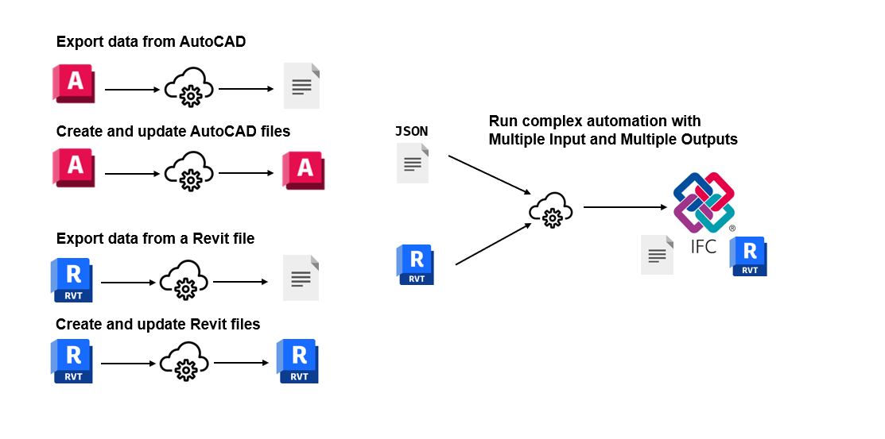

# APS Automation SDK



[](https://pypi.org/project/aps-automation-sdk/)

A Python SDK that wraps the Autodesk Platform Services (APS) [Design Automation API](https://aps.autodesk.com/en/docs/design-automation/v3/developers_guide/overview/), making it faster and easier to automate Revit and AutoCAD workflows in the cloud. 

## Installation

Get started in seconds with pip:


```bash
pip install aps-automation-sdk
```

## Capabilities

Currently, the SDK supports **AutoCAD** and **Revit**.

- **Export data from AutoCAD**: Extract information from DWG files and save to various formats
- **Create and update AutoCAD files**: Modify DWG files programmatically in the cloud
- **Export data from Revit files**: Extract data from RVT files (IFC, schedules, parameters, etc.)
- **Create and update Revit files**: Modify RVT files (add/delete elements, change parameters, etc.)
- **Run complex automation**: Execute workflows with multiple inputs and outputs, combining JSON configurations with CAD/BIM files

## Start Right Away

Test the SDK with our ready-to-use examples in the [`examples`](examples/) folder:

- **AutoCAD_01_list_layers**: Extract layer names from a DWG file
- **Revit_01_delete_walls**: Remove walls from a Revit model
- **Revit_02_export_to_ifc**: Export IFC files from Revit with custom settings
- **Revit_03_create_structural_elements**: Create structural beam elements from JSON configuration
- **Revit_04_change_global_params**: Modify global parameters in Revit models

Each example includes a Jupyter notebook with step-by-step instructions and sample files.

**Before running the examples**, create a `.env` file in the project root with your APS credentials:

```ini
CLIENT_ID=your_client_id_here
CLIENT_SECRET=your_client_secret_here
```

You can use `.env.sample` as a reference. To get your credentials, create an Autodesk Platform Services application at: https://get-started.aps.autodesk.com/

## Contribute
For contributing and local installation instructions, see [CONTRIBUTING.md](CONTRIBUTING.md).
